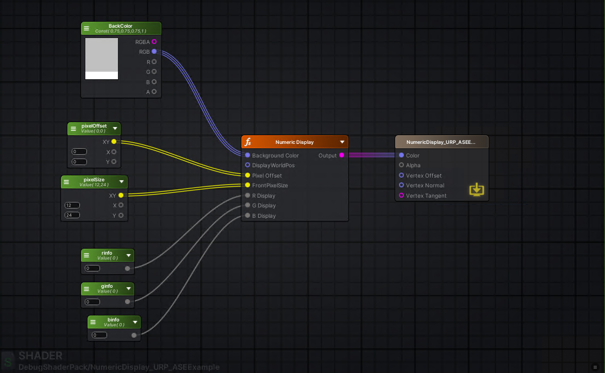

# Debug Shader Pack Numeric Display

## Preview

<video src="assets/addone_show.mp4" controls muted loop></video>



Unity Package Manager package for rendering numeric debug values directly inside shaders.

## Features

- Renders `RInfo`, `GInfo`, and `BInfo` in three rows.
- Uses red, green, and blue channel coloring for the three rows.
- Anchors the overlay to the current object's origin projected into screen space.
- Supports pixel offset and configurable character size.
- Truncates values to the supported range `-999.999` to `999.999`.
- Exposes regular HLSL functions and Amplify Shader Editor friendly `_float` entry points.
- Includes Built-in and URP example shaders.

## Requirements

- Unity `2022.3` or newer.

## Package Layout

- `Runtime/Shaders/DebugNumericDisplay.hlsl`
- `Documentation~/Usage.md`
- `Documentation~/Usage.en.md`
- `Samples~/Example`

## Install

Use one of these Unity Package Manager flows:

- `Add package from disk...` and select this package folder's `package.json`.
- Reference the package from a Git repository URL.
- Add a local path dependency in `Packages/manifest.json`.

## Quick Start

Include the runtime file from your shader:

```hlsl
#include "Packages/com.debugshaderpack.numeric-display/Runtime/Shaders/DebugNumericDisplay.hlsl"
```

For URP shaders, include `Core.hlsl` before the package file:

```hlsl
#include "Packages/com.unity.render-pipelines.universal/ShaderLibrary/Core.hlsl"
#include "Packages/com.debugshaderpack.numeric-display/Runtime/Shaders/DebugNumericDisplay.hlsl"
```

Detailed usage is available in `Documentation~/Usage.en.md`.

## Acknowledgements

The text encoding algorithm used by this package is based on the ShaderToy example: [https://www.shadertoy.com/view/Mt2GWD](https://www.shadertoy.com/view/Mt2GWD).
